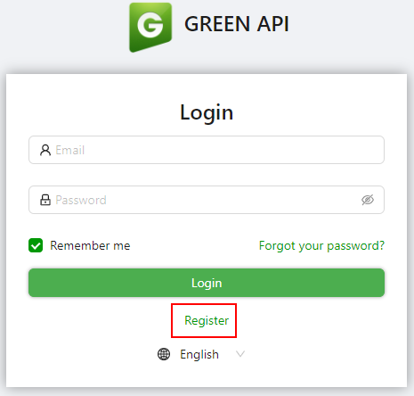
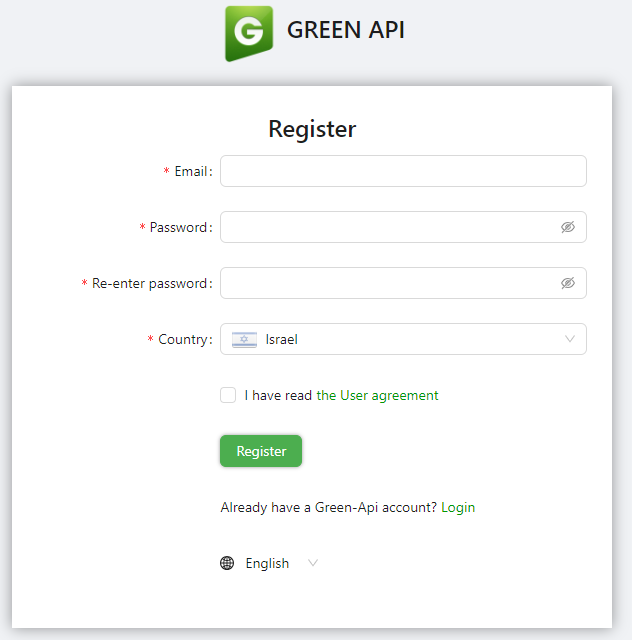
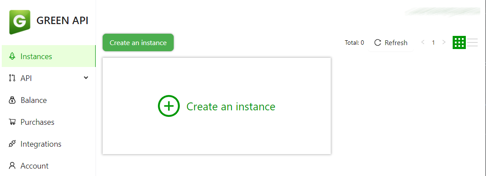
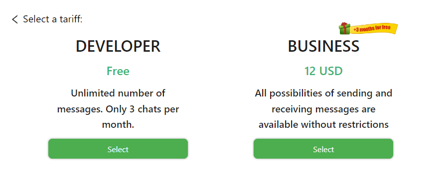
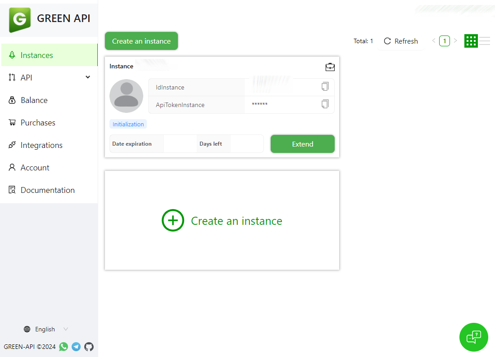
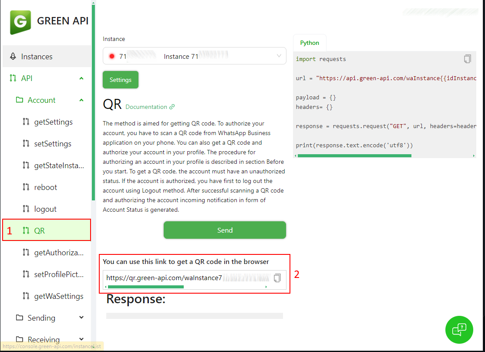
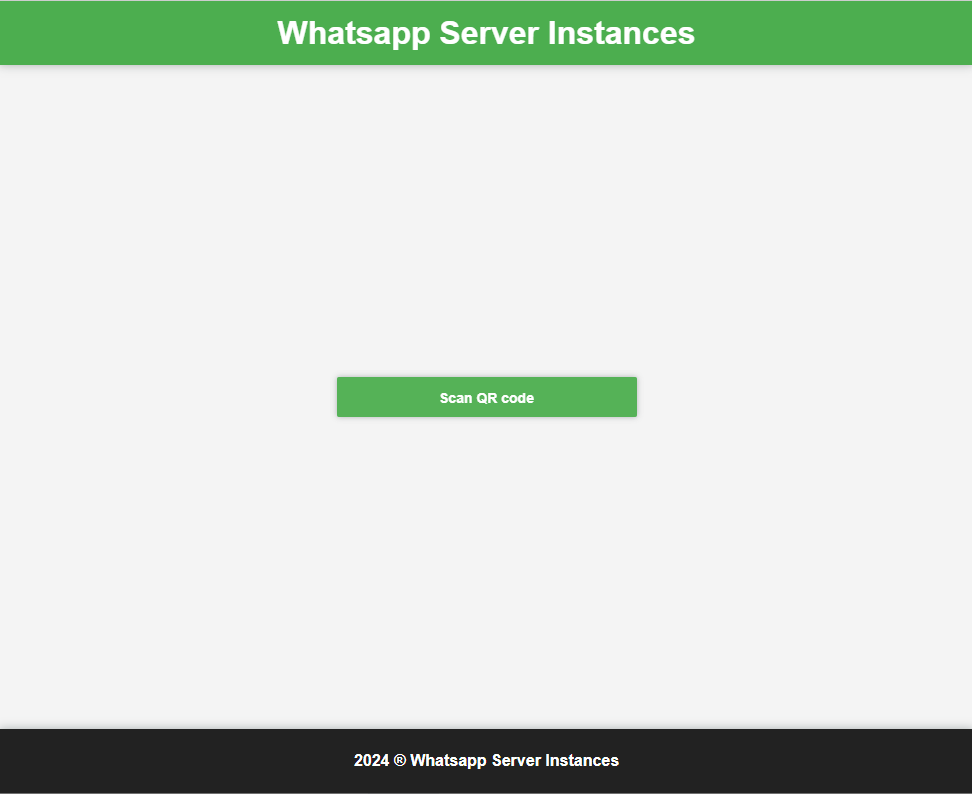

# woltcheck
Python script to check if a wolt restaurant is ready to deliver to your location

Prerequisits:
- Install necessary dependencies (python3 -m pip install -r requirements.txt)
- Install libgeos-dev (apt-get install libgeos-dev)
- Add your location to properties file. You can add it as freetext or in longitude/latitude format. 
  You can find your longitude/latitude using this site https://www.latlong.net/

### Setup Green API account
Nevigate to [https://green-api.com/en](https://green-api.com/en) and register for a new account:

Fill up your details and click on **Register**:

Next, click on the "Create an instance":

Select the "Developer" instance (Free):

Copy the InstanceId and Token, we need it for the integration settings:

Next, Lets connect our whatsapp with green-api. On the left side, Under API --> Account, click on QR and copy the QR URL to the browser and click on "Scan QR code"

Next, Scan the QR code to link you whatsapp with Green API:

If you wold like to get a push to your phone, just add your provider to the config file under Push section.
You can use one or more providers using the [Apprise](https://github.com/caronc/apprise) supported configs. 

Usage:
./wolt.py [-p] restaurant [restaurant] ...
-p send push when the restaurant status change

restaurant name is taken from the wolt url
example: https://wolt.com/en/isr/tel-aviv/restaurant/cafe-noir
  in this case "cafe-noir" is the restaurant name

Added support for notifications for MAC or WINDOWS (via WSL only for now)
If you want WSL notifications you will need to download this project:
https://github.com/stuartleeks/wsl-notify-send
and set the path for the exe in the config file
